# 💹 QuantSight — Financial Forecasting

<p align="center">


</p>

## Overview

QuantSight is a financial forecasting and machine learning project designed to predict the next trading day's closing price using historical market data and technical indicators.

The project is designed to be applicable across different financial instruments, including:

- Stocks
- ETFs
- Forex
- Indices
- Other time-series financial assets supported by `yfinance`

The project compares traditional statistical machine learning with neural networks and evaluates their performance against a naive baseline.

The primary objective is not to claim perfect market prediction, but to demonstrate a complete and reproducible financial machine learning workflow involving time-series data preparation, feature engineering, model selection, validation, evaluation, and visualization.

---

## Project Objectives

The project focuses on:

- Collecting historical financial market data
- Creating technical indicators
- Preparing time-series training and testing datasets
- Preventing temporal data leakage
- Comparing multiple regression models
- Performing time-series cross-validation
- Hyperparameter tuning
- Evaluating model performance using multiple metrics
- Comparing machine learning predictions against a naive baseline
- Building a neural network for comparison
- Performing residual and prediction analysis
- Visualizing financial trends and model performance

---

## Repository Structure

```text
QuantSight-Financial-Forecasting/
│
├── images/
│   ├── Correlation_Heatmap.png
│   ├── Closing_Price_Over_Time.png
│   ├── Price_With_Moving_Averages.png
│   ├── LinearRegression_Actual_VS_Predicted.png
│   ├── NeuralNetwork_Actual_VS_Predicted.png
│   ├── LinearRegression_Scatterplot.png
│   ├── Residual_Plot.png
│   ├── Residual_VS_Predicted.png
│   ├── Model_Comparison.png
│   ├── Daily_Return_Distribution.png
│   └── Volatility.png
│
├── model/
│   ├── model.pkl
│   ├── nn_model.keras
│   └── nn_scaler.pkl
│
├── notebook/
│   └── QuantSight_Financial_Forecasting.ipynb
│
├── Interface.py
├── README.md
└── requirements.txt
````

---

# Dataset

QuantSight retrieves historical financial data using the `yfinance` library.

The notebook currently demonstrates the project using:

```text
Ticker: TSLA
Start Date: 2020-01-01
```

The ticker can be changed to another supported financial instrument.

Example:

```python
Ticker = "AAPL"
```

or:

```python
Ticker = "MSFT"
```

The framework can also be adapted for other Yahoo Finance-supported assets.

---

# Target Variable

The target is the next trading day's closing price.

```python
df['Target'] = df['Close'].shift(-1)
```

Therefore:

```text
Today's market information → Tomorrow's closing price
```

This makes the problem a supervised time-series regression task.

---

# Features

The current model uses the following features:

| Feature    | Description                       |
| ---------- | --------------------------------- |
| Close      | Current closing price             |
| Volume     | Trading volume                    |
| High       | Daily high price                  |
| Low        | Daily low price                   |
| Open       | Daily opening price               |
| MA_10      | 10-day moving average             |
| MA_50      | 50-day moving average             |
| Volatility | 10-day rolling standard deviation |

An additional feature is calculated for analysis:

```text
Daily_Return
```

Daily return is calculated as:

```python
df['Daily_Return'] = df['Close'].pct_change()
```

---

# Feature Engineering

QuantSight uses technical indicators to provide the models with information about recent market behavior.

### 10-Day Moving Average

```python
df['MA_10'] = df['Close'].rolling(10).mean()
```

The 10-day moving average captures short-term price trends.

### 50-Day Moving Average

```python
df['MA_50'] = df['Close'].rolling(50).mean()
```

The 50-day moving average captures a longer-term trend.

### Volatility

```python
df['Volatility'] = df['Close'].rolling(10).std()
```

This measures short-term price variability.

### Daily Return

```python
df['Daily_Return'] = df['Close'].pct_change()
```

This measures the percentage change in closing price from one trading day to the next.

---

# Data Preprocessing

The project follows a chronological train-test split.

```python
train_test_split(
    features,
    target,
    test_size=0.2,
    shuffle=False
)
```

`shuffle=False` is important because financial data is time-dependent.

Randomly shuffling financial observations could introduce future information into the training process.

---

# Validation Strategy

QuantSight uses `TimeSeriesSplit` instead of conventional random K-Fold cross-validation.

```python
tscv = TimeSeriesSplit(n_splits=5)
```

This preserves the chronological order of the data.

Conceptually:

```text
Fold 1:
Train →→→ | Validation

Fold 2:
Train →→→→ | Validation

Fold 3:
Train →→→→→ | Validation

Fold 4:
Train →→→→→→ | Validation

Fold 5:
Train →→→→→→→ | Validation
```

This approach is more appropriate for financial time-series modelling.

---

# Models

The project evaluates several regression approaches.

## Linear Regression

A baseline linear model used to establish a simple relationship between the engineered features and the next closing price.

The implementation uses a `Pipeline`:

```python
Pipeline([
    ('scaler', StandardScaler()),
    ('model', LinearRegression())
])
```

## Ridge Regression

Ridge regression adds L2 regularization to reduce coefficient instability and potential multicollinearity.

## Lasso Regression

Lasso applies L1 regularization and can reduce less useful feature coefficients toward zero.

## Random Forest

Random Forest is used as a nonlinear ensemble regression model.

## XGBoost

XGBoost is evaluated as a gradient-boosted tree model capable of capturing nonlinear relationships.

## Neural Network

A feed-forward neural network is implemented using TensorFlow/Keras.

Architecture:

```text
Input Layer
     ↓
Dense(32, ReLU)
     ↓
Dropout(0.1)
     ↓
Dense(16, ReLU)
     ↓
Dense(1)
```

Early stopping is used to reduce overfitting.

---

# Model Selection

Models are evaluated using:

* R²
* Mean Absolute Error (MAE)
* Root Mean Squared Error (RMSE)

### R²

Measures the proportion of variance explained by the model.

Higher is better.

### MAE

Measures the average absolute prediction error.

Lower is better.

### RMSE

Penalizes larger prediction errors more heavily than MAE.

Lower is better.

---

# Hyperparameter Tuning

Linear Regression was further evaluated using `GridSearchCV`.

Parameters considered:

```python
param_grid = {
    'model__fit_intercept': [True, False],
    'model__positive': [True, False]
}
```

The optimization objective was:

```text
Negative Root Mean Squared Error
```

with:

```text
TimeSeriesSplit
```

This ensures that model selection also respects the temporal structure of the dataset.

---

# Baseline Comparison

QuantSight also uses a naive forecasting strategy.

The naive prediction is:

```python
naive_pred = x_test['Close'].values
```

This assumes:

```text
Tomorrow's price = Today's closing price
```

The machine learning model must therefore outperform this baseline to demonstrate meaningful predictive improvement.

---

# Model Performance

The final performance depends on the selected financial instrument and the historical period used.

For the current TSLA experiment, the Linear Regression model achieved approximately:

| Metric | Linear Regression |
| ------ | ----------------: |
| R²     |              0.95 |
| MAE    |              9.14 |
| RMSE   |             11.83 |

The naive baseline achieved approximately:

| Metric | Naive |
| ------ | ----: |
| MAE    |  8.98 |
| RMSE   | 11.73 |

These results demonstrate an important point: a high R² does not necessarily mean that a forecasting model is superior to a simple persistence baseline.

For financial forecasting, model evaluation should therefore consider both statistical metrics and baseline performance.

---

# Exploratory Data Analysis

The project contains several visualizations.

### Correlation Heatmap

Shows relationships between the numerical features.

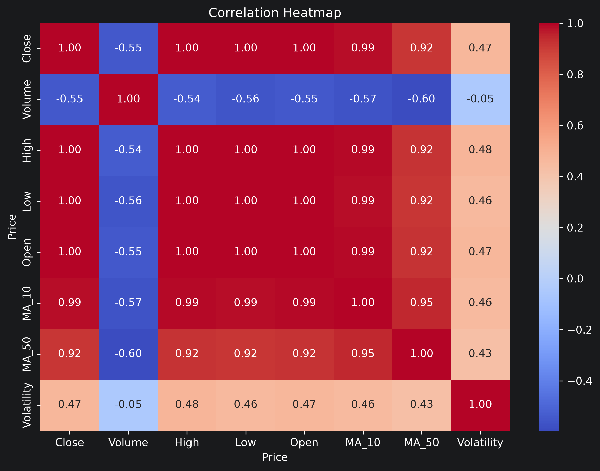

### Closing Price

Shows the historical closing-price trend.

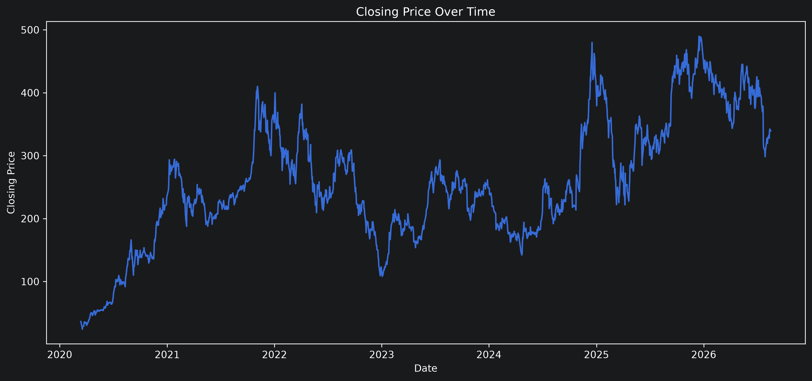

### Moving Averages

Compares the closing price with the 10-day and 50-day moving averages.

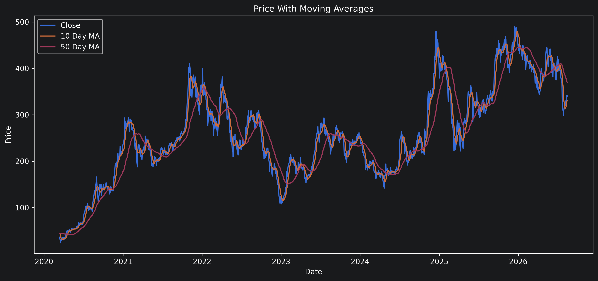

### Linear Regression Predictions

Compares actual and predicted prices on the test set.

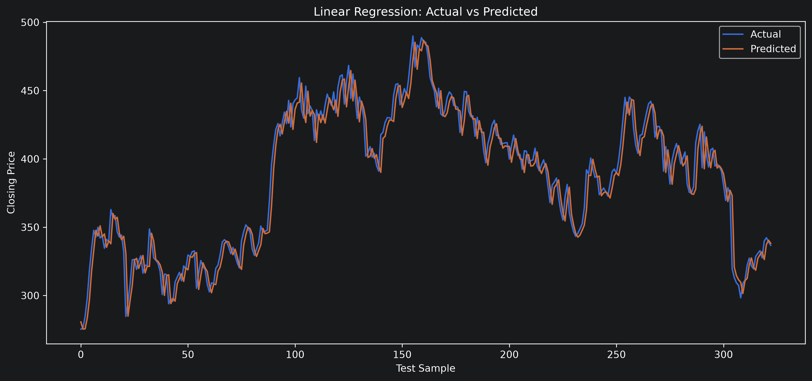

### Neural Network Predictions

Compares neural network predictions against actual prices.

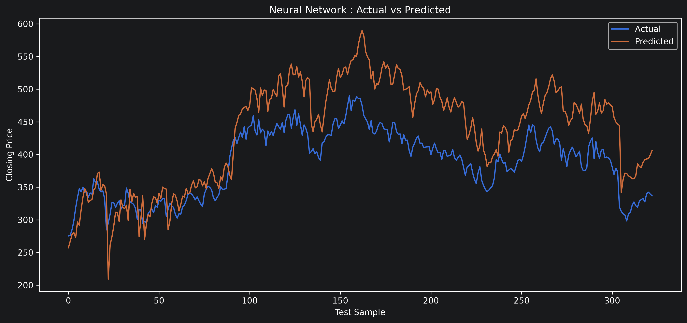

### Prediction Scatter Plot

Shows the relationship between actual and predicted prices.

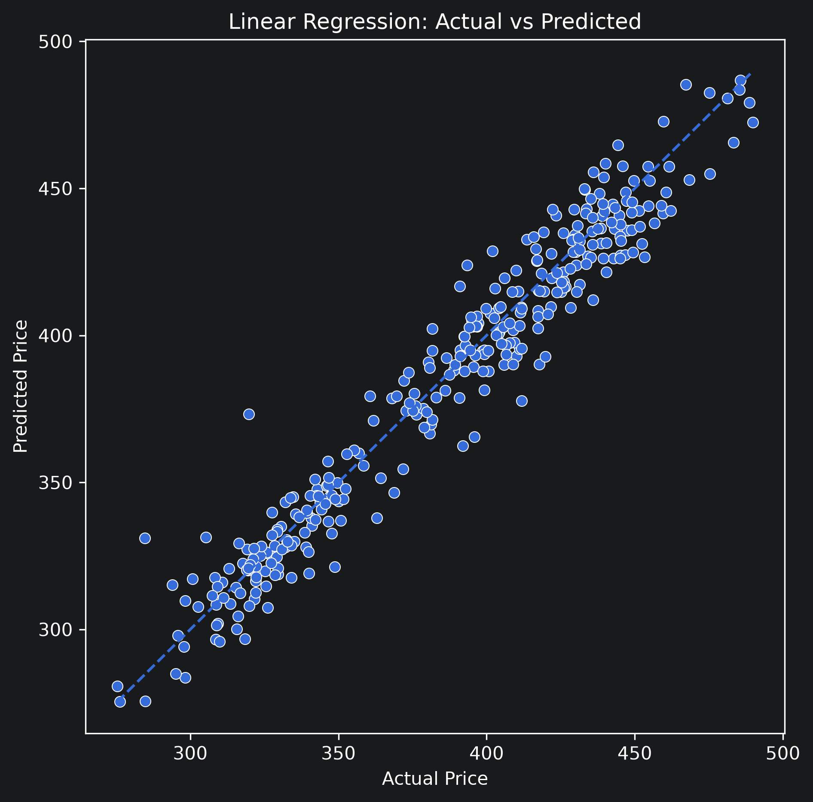

### Residual Distribution

Shows the distribution of prediction errors.

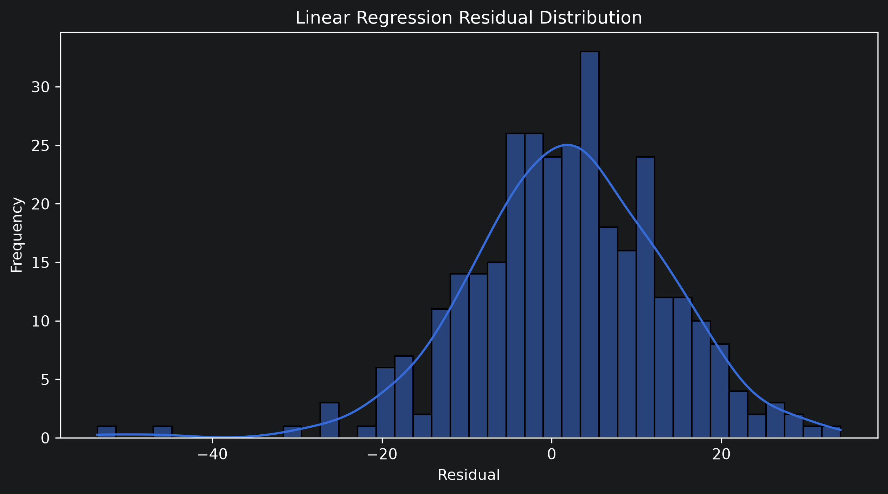

### Residuals vs Predicted

Helps identify systematic prediction errors.

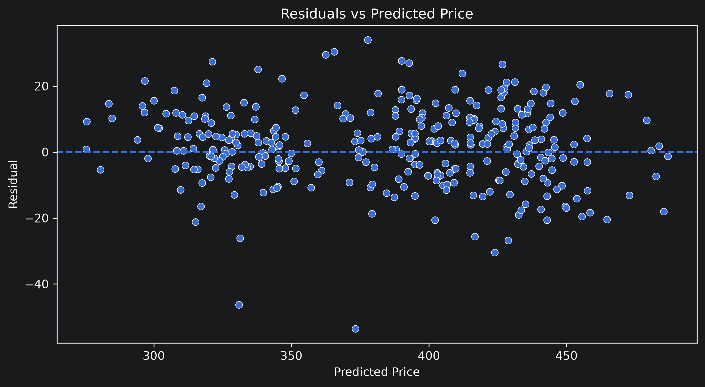

### Model Comparison

Compares model RMSE values.

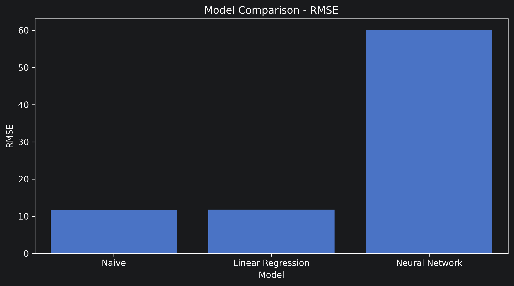

### Daily Returns

Shows the distribution of daily percentage returns.

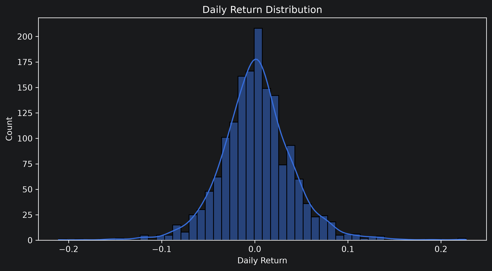

### Volatility

Shows how short-term market volatility changes over time.

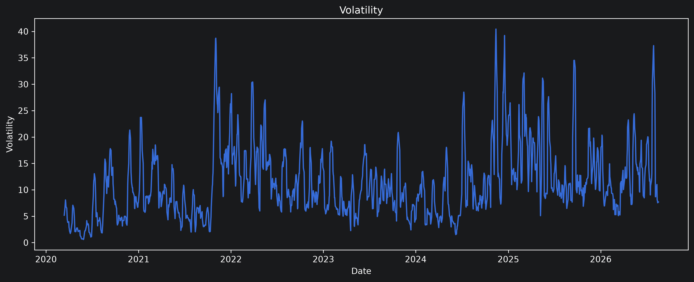

---

# Saved Models

The trained models and preprocessing objects are stored in the `model/` directory.

```text
model/
├── model.pkl
├── nn_model.keras
└── nn_scaler.pkl
```

### `model.pkl`

Contains the trained Linear Regression pipeline, including its `StandardScaler`.

### `nn_model.keras`

Contains the trained TensorFlow/Keras neural network.

### `nn_scaler.pkl`

Contains the scaler used for neural network inputs.

The scaler is saved because the neural network expects new input data to undergo the same preprocessing used during training.

---

# Installation

Clone the repository:

```bash
git clone https://github.com/Pranav-1719/Data-Science-Machine-Learning.git
```

Navigate to the project:

```bash
cd Data-Science-Machine-Learning/QuantSight-Financial-Forecasting
```

Create and activate a virtual environment if required:

```bash
python -m venv venv
```

Windows:

```bash
venv\Scripts\activate
```

Install dependencies:

```bash
pip install -r requirements.txt
```

---

# Running the Project

Open the notebook:

```text
notebook/QuantSight_Financial_Forecasting.ipynb
```

Run the notebook sequentially to:

1. Download financial data
2. Clean the dataset
3. Generate technical indicators
4. Split the time-series data
5. Perform cross-validation
6. Train regression models
7. Tune the Linear Regression model
8. Train the neural network
9. Evaluate the models
10. Generate visualizations
11. Save trained models

---

# Interface

The repository also contains:

```text
Interface.py
```

This file can be used as the basis for an interactive interface around the trained forecasting models.

The interface can be extended to allow users to select:

* Financial instrument
* Historical period
* Model
* Prediction parameters
* Technical indicators

---

# Limitations

Financial markets are highly complex and influenced by factors that are not fully represented by historical price data.

Current limitations include:

* Limited technical indicators
* No fundamental financial data
* No macroeconomic variables
* No news or sentiment analysis
* No order-book information
* No intraday market data
* One-step-ahead price prediction
* Limited model complexity
* Historical performance does not guarantee future performance

A high R² score should not be interpreted as proof that the model can reliably predict future market movements.

This project is intended for educational and research purposes and should not be considered financial advice.

---

# Future Improvements

Potential extensions include:

* Indicators (RSI, MACD , Bollinger Bands, ATR)
* Exponential Moving Averages
* Forex-specific features
* Cryptocurrency support
* News sentiment analysis
* Fundamental analysis
* FastAPI deployment
* Dockerization


---

# Technologies Used

| Category            | Technologies                  |
| ------------------- | ----------------------------- |
| Programming         | Python                        |
| Data Collection     | yfinance                      |
| Data Processing     | Pandas, NumPy                 |
| Visualization       | Matplotlib, Seaborn           |
| Machine Learning    | Scikit-learn                  |
| Gradient Boosting   | XGBoost                       |
| Deep Learning       | TensorFlow, Keras             |
| Model Selection     | TimeSeriesSplit, GridSearchCV |
| Model Serialization | Joblib                        |
| Development         | Jupyter Notebook              |
| Version Control     | Git, GitHub                   |

---

# Skills Demonstrated

* Financial Data Analysis
* Time-Series Forecasting
* Feature Engineering
* Technical Indicator Development
* Regression Modelling
* Neural Networks
* Model Selection
* Time-Series Cross-Validation
* Hyperparameter Tuning
* Model Evaluation
* Residual Analysis
* Data Visualization
* Python
* Scikit-learn
* TensorFlow
* XGBoost
* Git and GitHub

---

# Disclaimer

QuantSight is an educational machine learning project.

The predictions generated by this project should not be considered investment recommendations, trading signals, or financial advice. Financial markets involve significant uncertainty and risk.

---

# Author

**Pranav Sankpal**

Computer Science Engineering Student
Government College of Engineering, Kolhapur

GitHub:
[https://github.com/Pranav-1719](https://github.com/Pranav-1719)

LinkedIn:
[https://www.linkedin.com/in/pranav-s-sankpal](https://www.linkedin.com/in/pranav-s-sankpal)

Portfolio:
[https://pranavsankpal.lovable.app/](https://pranavsankpal.lovable.app/)

---

# License

This project is licensed under the MIT License.

---