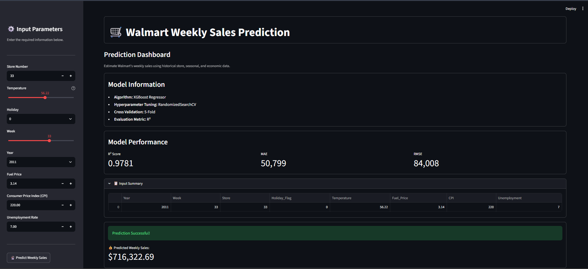
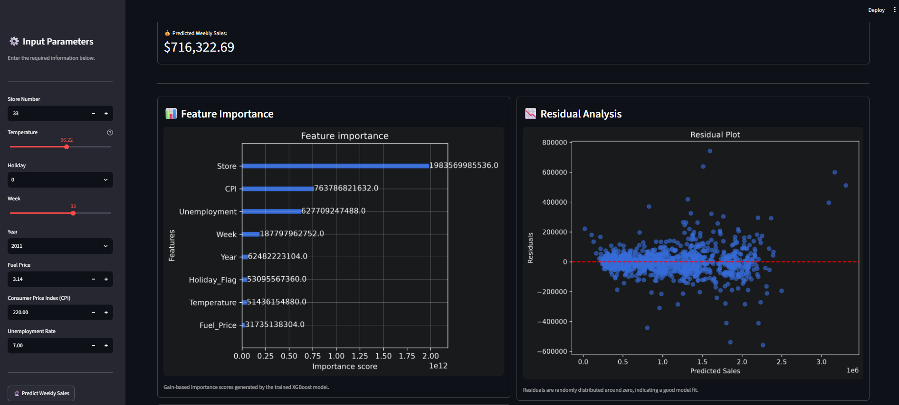
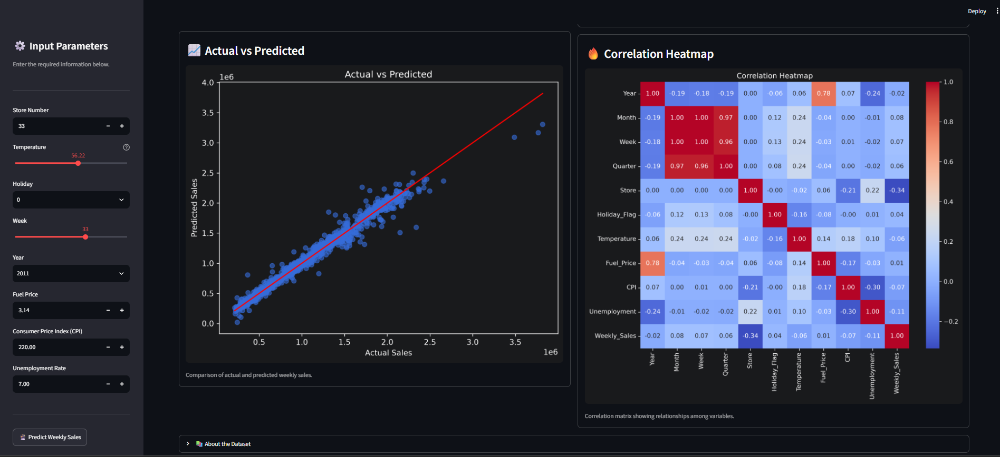
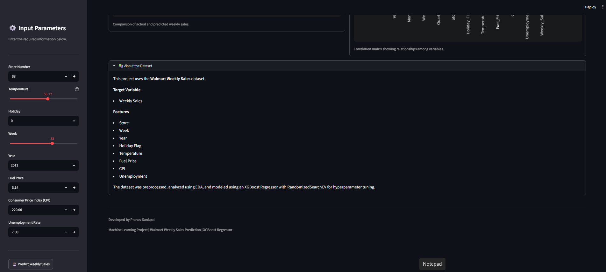

# 🛒 Walmart Weekly Sales Prediction
<p align="center">


</p>
An end-to-end machine learning project for predicting Walmart's weekly sales using historical sales data, seasonal information, and economic indicators.

The project demonstrates a complete machine learning workflow, including data preprocessing, feature engineering, exploratory data analysis (EDA), model development, hyperparameter tuning, model evaluation, business intelligence dashboard development using Tableau, and deployment through a Streamlit web application.

---

## 🟢 Live Demo

**Streamlit Application**

https://walmart-sales-prediction-ps.streamlit.app/

---

# Project Overview

This project covers the complete lifecycle of a supervised machine learning regression problem.

The repository includes:

- Data Cleaning
- Feature Engineering
- Exploratory Data Analysis (EDA)
- Feature Selection
- Feature Scaling
- Multiple Regression Models
- Cross Validation
- Hyperparameter Tuning
- Model Evaluation
- Feature Importance Analysis
- Residual Analysis
- Tableau Dashboard
- Streamlit Deployment

---

# Repository Structure

```text
Walmart-Sales-Prediction/
│
├── dashboard/
│   └── Walmart-sales-dashboard.twb
│
├── data/
│   ├── Walmart_Sales.csv
│   └── Walmart_Sales_Cleaned.csv
│
├── images/
│   ├── Actual_vs_Predicted.png
│   ├── CPI_vs_Weekly_Sales.png
│   ├── Feature_Importance.png
│   ├── Fuel_Price_vs_Weekly_Sales.png
│   ├── Heatmap.png
│   ├── Holiday_vs_Weekly_Sales.png
│   ├── Monthly_Sales_Trend.png
│   ├── Residual_plot.png
│   ├── Store_Wise_Sales.png
│   ├── Temperature_vs_Weekly_Sales.png
│   ├── Unemployment_vs_Weekly_Sales.png
│   └── Weekly_sales_distribution.png
│
├── model/
│   ├── XGBoost_model.pkl
│   └── scaler.pkl
│
├── notebook/
│   └── Walmart_Sales_Prediction.ipynb
│
├── src/
│   ├── Dashboard_SS.png
│   ├── SS_1.png
│   ├── SS_2.png
│   ├── SS_3.png
│   └── SS_4.png
│
├── app.py
├── requirements.txt
└── README.md
```

---

# Dataset

**Dataset:** Walmart Weekly Sales Dataset

### Target Variable

- Weekly_Sales

### Input Features

- Store
- Holiday_Flag
- Temperature
- Fuel_Price
- CPI
- Unemployment
- Date

### Feature Engineering

The original `Date` feature was transformed into:

- Year
- Month
- Week
- Quarter

The processed dataset was exported separately for Tableau dashboard development.

---

# Methodology

The project follows the standard machine learning workflow.

1. Data Cleaning
2. Feature Engineering
3. Exploratory Data Analysis
4. Feature Scaling
5. Model Development
6. Cross Validation
7. Hyperparameter Tuning
8. Model Evaluation
9. Model Deployment

---

# Models Implemented

The following regression models were evaluated:

- Linear Regression
- Lasso Regression
- XGBoost Regressor

Hyperparameter optimization was performed using **RandomizedSearchCV** with **5-Fold Cross Validation**.

---

# Model Performance

| Metric | Value |
|---------|-------:|
| R² Score | **0.9781** |
| Mean Absolute Error | **50,798.88** |
| Root Mean Squared Error | **84,007.97** |
| Cross Validation R² | **0.9763** |

The XGBoost model achieved the best overall performance and explained approximately **97.8%** of the variance in weekly sales.

---

# Exploratory Data Analysis

The analysis includes:

- Weekly Sales Distribution
- Sales Boxplots
- Monthly Sales Trend
- Store-wise Sales Analysis
- Holiday Impact
- Temperature vs Sales
- Fuel Price vs Sales
- CPI vs Sales
- Unemployment vs Sales
- Correlation Heatmap

---

# Tableau Dashboard

A Tableau dashboard was developed using the processed dataset to provide business-oriented insights through interactive visualizations.

### Dashboard Features

- Total Sales KPI
- Average Weekly Sales
- Average CPI
- Store Performance Analysis
- Monthly Sales Trend
- Holiday Impact Analysis
- Interactive Filters
    - Year
    - Quarter
    - Holiday Flag
    - Store

### Dashboard Preview


---

# Streamlit Application

The project includes an interactive Streamlit application for real-time sales prediction.

### Features

- Weekly Sales Prediction
- Interactive User Inputs
- Model Performance Summary
- Feature Importance
- Residual Analysis
- Correlation Heatmap

### Application Preview

#### Home



#### Prediction



#### Analysis



#### Model Information



---

# Technologies Used

| Category | Technologies |
|----------|--------------|
| Programming | Python |
| Data Analysis | Pandas, NumPy |
| Visualization | Matplotlib, Seaborn |
| Machine Learning | Scikit-learn, XGBoost |
| Hyperparameter Tuning | RandomizedSearchCV |
| Business Intelligence | Tableau |
| Deployment | Streamlit |
| Model Serialization | Joblib |
| Development Tools | Jupyter Notebook, Git, GitHub |

---

# Installation

Clone the repository.

```bash
git clone https://github.com/Pranav-1719/Data-Science-Machine-Learning.git
```

Navigate to the project directory.

```bash
cd Data-Science-Machine-Learning/Walmart-Sales-Prediction
```

Install dependencies.

```bash
pip install -r requirements.txt
```

Run the application.

```bash
streamlit run app.py
```

---

# Future Improvements

- SHAP Explainability
- Batch Prediction via CSV Upload
- REST API using FastAPI
- Docker Support
- CI/CD Pipeline
- MLflow Experiment Tracking

---

# Skills Demonstrated

- Machine Learning
- Regression Analysis
- Data Cleaning
- Feature Engineering
- Exploratory Data Analysis
- Data Visualization
- Business Intelligence
- Tableau Dashboard Development
- Model Evaluation
- Hyperparameter Tuning
- Streamlit Deployment

---

# Author

**Pranav Sankpal**

Computer Science Engineering Student

Government College of Engineering, Kolhapur

**Portfolio:** https://pranavsankpal.lovable.app/

**GitHub:** https://github.com/Pranav-1719

**LinkedIn:** https://www.linkedin.com/in/pranav-s-sankpal

**Email:** sankpalpranav022@gmail.com